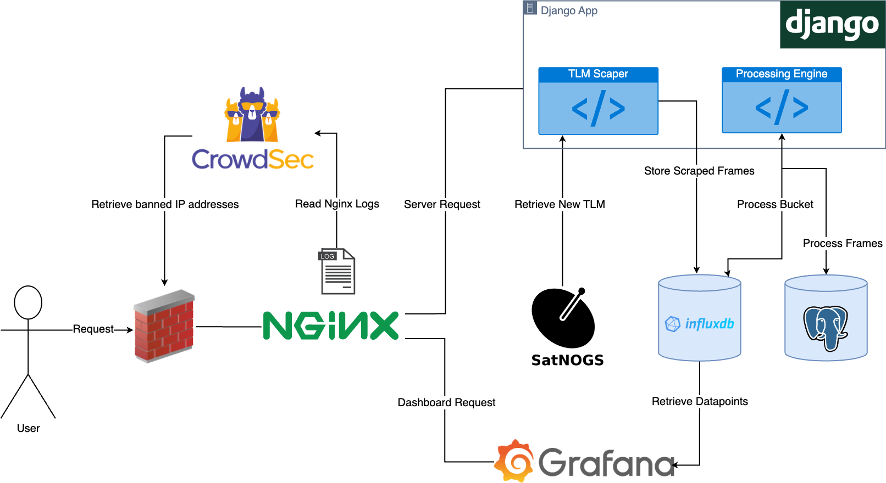
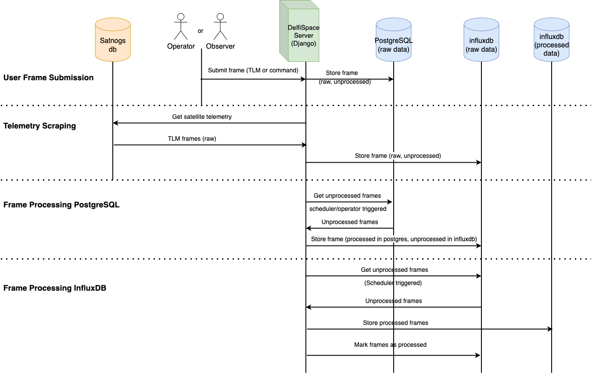
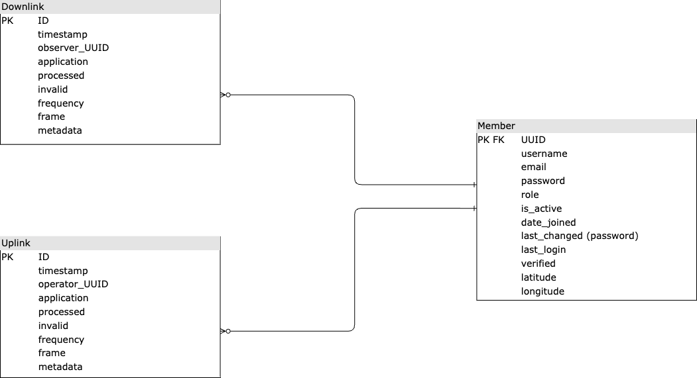

# Software architecture

This section will cover a description of the active components and their role within the system, as well as the interactions and data flow between them. As an overview, an Nginx reverse proxy routes the traffic to the requested service, either Grafana Dashboards for data visualization, or a website related functionality implemented in the Django web app. Additionally, the satellite data is stored in an InfluxDB time series database which is the datasource for Grafana. Temporarily, user submitted telemetry will be stored in a PostgreSQL relational database, and as soon as the frames are validated, they are moved over to the time series database. To secure against brute-force attacks, DDoS and other malicious behavior, we use CrowdSec to enforce bans on bad actors.

 *Architecture*

## The web app and back-end logic with Django

The web app encapsulates the back-end logic of the system that handles the server API, user account management, front-end templates, as well as data processing and bookkeeping.

In terms of structure, there is an a [Django application](https://docs.djangoproject.com/en/4.1/intro/tutorial01/) created for each satellite (`delfipq`, `delfic3`, etc.) that contains satellite specific files, such as the XTCE XML files, or functionality exposed via the API. Additionally, the `home` app is concerned with public content on the website, while the `members` app implements user management functionality, and the `processing` app provides the satellite data retrieval and processing engine.

Data is sourced from either user submissions or scraped from SatNOGS. The uplink data is registered by the ground station operators, while the downlink telemetry is pushed from a local ground station and also crowdsourced from external radio amateurs. The registered data exchange between ground and satellite is primarily stored in the time series database in raw hexadecimal form, as well as parsed/processed. In InfluxDB we make use of different buckets for raw and processed data such that they can be managed independently.

### Data processing, crowdsourcing and scraping

The incoming submitted satellite communications data is first validated by the server and stored temporarily into the PostgreSQL relational database. On the other hand, the SatNOGS telemetry scraper stores the frames directly into the InfluxDB time series database. For a visual illustration, this workflow is depicted in the sequence diagram below under *User Frame Submission* and *Telemetry Scraping*. At this point the back-end contains only raw data in hexadecimal form. To parse it, an operator needs to trigger a processing task. Processing can happen in two stages depending on the initial source of the data:

1. User submitted
   - as submissions are stored in the relational database, they are validated by checking if they can be parsed with the XTCE description of a satellite from the platform. If the validation is successful the raw frame is copied to the time series database and the operator can choose to remove it from the relational database, since it is intended to serve as a frame submission buffer. This processing step corresponds to the *Frame Processing PostgreSQL* part from the sequence diagram.

2. Scraped from SatNOGS
   - SatNOGS data is added directly to the InfluxDB raw data bucket together with validated submitted frames. At this stage the operators can trigger a processing task that parses newly added, unprocessed data and adds the parsed values to the corresponding bucket. This is final part of the processing pipeline and corresponds with the *Frame Processing InfluxDB* from the sequence diagram. Now the data can be used to create Grafana Dashboards.

 *Data Processing Sequence Diagram*

### Scheduling Jobs

The data processing and the telemetry scraper are intended to be triggered via the scheduler found in the `processing` app, which can be configured to run with an indicated amount of threads. To successfully configure the thread count, the value must not conflict with the Nginx configuration. As such, multiple jobs are able to execute in parallel:

- frame buffer processing (PostgreSQL)
- raw bucket processing (InfluxDB)
- telemetry scraping

As a safeguard against data inconsistencies and deadlocks, the scheduler implements the Singleton design pattern that ensures there will be only one scheduler instance running at all times after instantiation. Moreover, the scheduler allows only one instance of a task to run at a time.

## Data storage with PostgreSQL and InfluxDB

As mentioned, user submitted data is first stored into a PostgreSQL relational database and later moved to the time series InfluxDB database. To keep track of the origin of the data later on, the UUID of the user who submitted the data will be carried over to the time series database. Furthermore, the relational database is also used for the user account management system implemented in the `members` app providing login, registration, password change and reset features. The detailed schema of the relational database can be found in the figure below.

Ultimately, data is stored into InfluxDB buckets, each having a retention policy set at creation to discard of old data that is no longer relevant, but infinite retention is also available and it is the default policy if no retention is specified. Within the buckets, data is stored in measurements, similar to a table in relational database, storing tags, fields, and the `time` column.

Each satellite has 3 dedicated buckets to store data:
- 1 raw data bucket storing frame in hexadecimal format for both the uplink and downlink stream
- 1 processed data bucket for the uplink stream
- 1 processed data bucket for the downlink stream with separate measurements for each satellite subsystem.

The raw data buckets serve as archives, while the processed data buckets can be used for analytics and dashboards.

 *Relational Database Schema*

## Data visualization and dashboards with Grafana

Grafana runs independently of the web app, requiring merely a datasource to fetch time series data to be visualized. Dashboards can be created and edited to query data from the InfluxDB database with queries written in the Flux language. It is worth noting that the InfluxDB client has a built-in [Flux query builder](https://docs.influxdata.com/influxdb/cloud/query-data/execute-queries/data-explorer/), which can be used to avoid the tedious process of writing the queries by hand. When a dashboard is edited, it should be exported to JSON and added to the `grafana/dashboards` folder such that it can be automatically loaded when starting the Grafana container via Docker.

## Security with CrowdSec

CrowdSec parses nginx access logs as configured in `acquis.yaml` and checks against a set of scenarios that could indicate an attack is happening. If that is to happen, CrowdSec issues an alert and the bouncer will block that specific IP address. The bouncer polls CrowdSec at a regular interval to obtain the updated list of banned IP addresses and enforces the ban. The exact interval length is configurable. In our setup, we run the [Firewall Bouncer](https://docs.crowdsec.net/docs/bouncers/firewall/) that uses the host's firewall to block malicious behavior.

